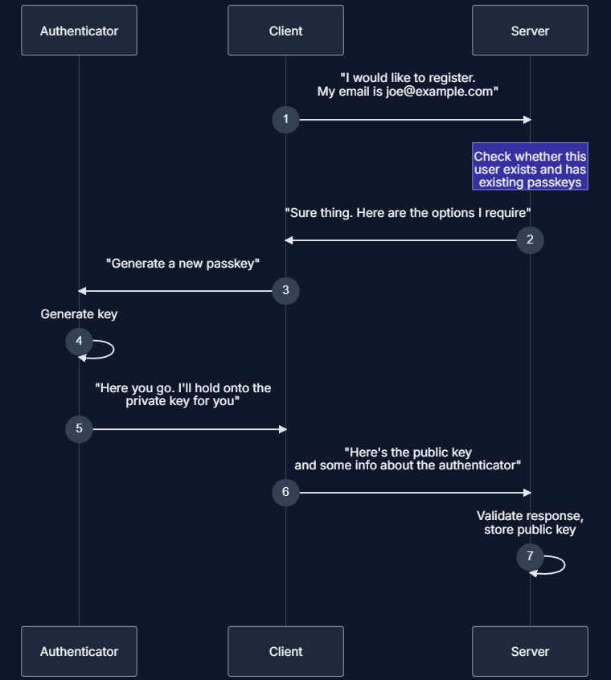
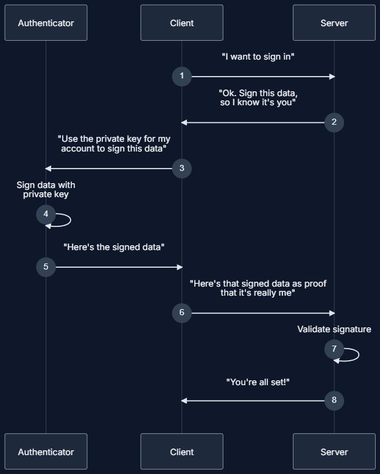

# WebAuthn + Next.js

This project is an example to use WebAuthn with **Next.js** and **Postgres**.

It uses the client side to render the forms and the server side actions to authenticate the user using WebAuthn returning a **Set-Cookie** header response with the **JWT** token.

The Login and Register pages can be accessed under `app/auth` folder; and the server side actions are under the `actions` folder.

The `middleware.ts` file is responsible to check if the user can access the public or the protected routes.

The `ddl.sql` is the database schema that I used in Postgres. Basically the user can have multiple devices (multiple credentials) under the same account. Of course we can add more security layers to satisfy a [Strong Customer Authentication condition](https://www.openbanking.org.uk/glossary/strong-customer-authentication/).

# How it works
If you want (and I recommend) to understand what is and why WebAuthn exists, please visit https://webauthn.guide/#about-webauthn, https://developer.mozilla.org/en-US/docs/Web/API/Web_Authentication_API, https://www.w3.org/TR/webauthn-3/ and https://simplewebauthn.dev/docs/simplewebauthn/philosophy (the last one is more why use this specific lib).

## Register
**1.** Access the Register Page (/auth/signup) and input your email
  - That step is Client Side

**2.** Hit the register button
  - A server action that gets the registration options and returns to the Client
  - With the options in place from the Relying Party, we pass them to the WebAuthn API in the browser
  - With the response, we call another server action to store the data received in the Postgres (most important the Public Key)

**3.** Receive a JWT token by the [Set-Cookie Response Header](https://developer.mozilla.org/en-US/docs/Web/HTTP/Headers/Set-Cookie) that can be used as a session for the user

**4.** The `middleware.ts` can now check if the user is logged in by the JWT verification and the protected routes will be available

Process available at https://webauthn.wtf/how-it-works/registration

## Login
**1.** Access the Login Page (auth/login) and input your email
  - That step is Client Side

**2.** Hit the login button
  - A server action is called to verify the user and (if exists) generate the authentication options for the Client
  - The client receives the options from the Relying Party and we call the authentication from the WebAuthn API in the browser
  - With the response from the authentication in place, we call the last server action to verify and authenticate the user based in the challenge, public key and other extra information (that you can configure)

**3.** Receive a JWT token by the [Set-Cookie Response Header](https://developer.mozilla.org/en-US/docs/Web/HTTP/Headers/Set-Cookie) that can be used as a session for the user

Process available at https://webauthn.wtf/how-it-works/authentication

## TODO (things that can be enhanced)
Since the main objective here is to show the WebAuthn authentication with Next.js, you'll notice some points for improvement (like the TODOs I left behind hehehe):

- Use an ORM like [Prisma](https://www.prisma.io/)
- Standardize the API responses by the middleware using [Either strategy](https://gcanti.github.io/fp-ts/modules/Either.ts.html)
- Create some common components like Cards, Input, Buttons, etc
- Split the server actions into more pure functions
- Create an utils for the Cookies
- Some SQL queries can be combined and maybe use the open/close connection (++performance and data consumption)
- Error handler (logs, observability, etc)
- Theme configuration

## Stack:
- [Next.js](https://nextjs.org/)
- [SimpleWebAuthn](https://simplewebauthn.dev/)
- [Postgres](https://www.postgresql.org/)
- [Vercel](https://vercel.com/)
- [React Hook Form](https://react-hook-form.com/)
- [Zod](https://zod.dev/)
- [Jose](https://github.com/panva/jose)
- [Tailwind CSS](https://tailwindcss.com/)

## Utilities:
- [ESlint](https://github.com/eslint/eslint)
- [Prettier](https://prettier.io/)
- [Husky](https://typicode.github.io/husky/)
- [lint-staged](https://github.com/lint-staged/lint-staged)
